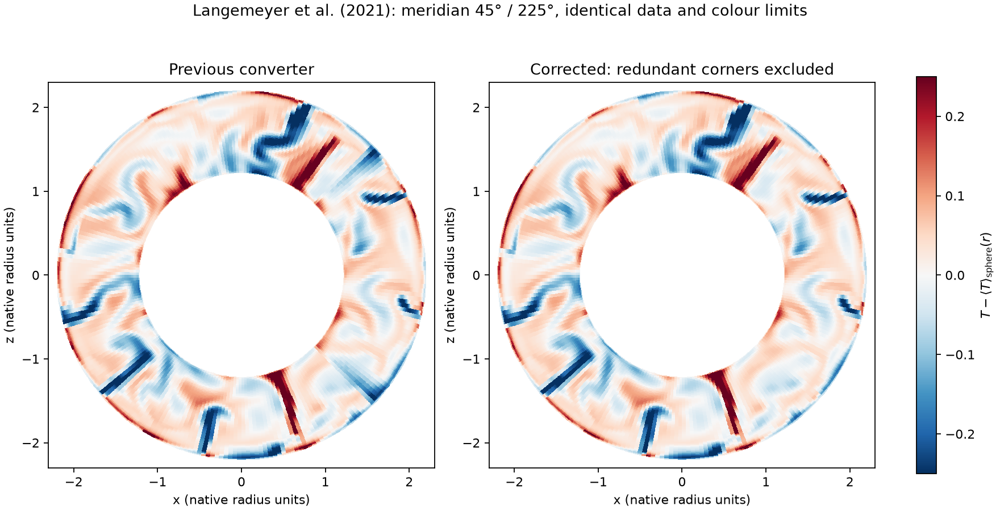

# StagYY: a downloadable 3-D mantle volume

`tools/convert_stagyy_to_viewer.py` converts legacy binary spherical Yin–Yang
StagYY volumes into DEEP's `r × theta × phi` float32 volumes. Both patches are
included. The output supports interior cuts, isosurfaces, longitude averages
and Mollweide maps at any sampled radius. VTK is not required.

## Version 1.1: meridional seam correction

Version 1.0 blended the full rectangular Yin–Yang patches, including redundant
corner regions which the reference StagYY exporter removes. Those values can
disagree with the active patch and introduced radial bands at fixed latitudes,
particularly visible in `T_anomaly`. The binary processor ordering and the
radial-mean subtraction were not the cause.

Version 1.1 removes those corners using the
[reference StagYY VTK routine](https://github.com/auguryerc/ReadStagYY/blob/fa7969ade79817fcac255cd9d6a9864eaec25873/WriteStag3D_VTK_YinYang_LB.m),
triangulates the retained sphere, and interpolates across the stitched mesh.
This applies to every input field, including Cartesian-rotated velocity;
diagnostics are then recalculated. No filtering or smoothing of physical
structures is added. The regression test now deliberately poisons redundant
corner values and requires identical T, T_anomaly and advection outputs.

**Reconvert existing StagYY outputs after updating.** Add `--force` to your
previous conversion command, then reopen the regenerated dataset in DEEP.
The converter version in `metadata.json` must be **1.1.0**.



## Another 3-D dataset: Mallard et al. (2016)

[PJB6_YS1 model steps 30–39](https://doi.org/10.5281/zenodo.20728077), deposited
by Anthony Jourdon (2026), provides ten full 3-D StagYY snapshots associated
with Mallard, Coltice, Seton, Müller & Tackley (2016),
[Subduction controls the distribution and fragmentation of Earth's tectonic
plates](https://doi.org/10.1038/nature17992), *Nature* 535, 140–143.
**Data license: CC BY 4.0**; credit the data deposit and the paper.

Each frame contains `t`, `eta`, and `vp`: full mantle temperature, viscosity,
velocity and pressure on a 128 × 384 × 64 × 2 Yin–Yang grid. This is a model
of self-organized plates and subduction, not an imposed geological plate
reconstruction. The archived numbers 30–39 are snapshot indices, not ages in Ma.

The archive is **1,335,785,967 bytes** (1.34 GB), MD5
`10f8a6ce4a4229bd45739e5f052495e1`; the 30 extracted binary files occupy about
1.53 GB. The complete archive was downloaded and its checksum verified.
Frames 30 and 39 were converted with the corrected converter as a two-frame
sequence, retaining all 27 fields and saved times.

After installing `requirements-stagyy.txt` as below, run from DEEP:

```bash
STAGYY_MALLARD="$HOME/Downloads/stagyy-mallard2016"
mkdir -p "$STAGYY_MALLARD"
curl -fL --retry 3 \
  "https://zenodo.org/api/records/20728077/files/PJB6_YS1.tar.gz/content" \
  -o "$STAGYY_MALLARD/PJB6_YS1.tar.gz"

printf '%s  %s\n' "10f8a6ce4a4229bd45739e5f052495e1" \
  "$STAGYY_MALLARD/PJB6_YS1.tar.gz" | md5sum -c - &&
tar -xzf "$STAGYY_MALLARD/PJB6_YS1.tar.gz" -C "$STAGYY_MALLARD"

python3 tools/convert_stagyy_to_viewer.py \
  --input "$STAGYY_MALLARD/PJB6_YS1/PJB6_YS1_Rh32_t00039" \
  --out "/mnt/c/Users/wgdh881/Desktop/public/data_stagyy_Mallard16" \
  --title "StagYY — Mallard et al. 2016, PJB6_YS1" \
  --source-url "https://doi.org/10.5281/zenodo.20728077" \
  --incremental --cache-dir "$HOME/.cache/deepscope"
```

For the full ten-frame sequence instead:

```bash
python3 tools/convert_stagyy_to_viewer.py \
  --input "$STAGYY_MALLARD"/PJB6_YS1/PJB6_YS1_Rh32_t0003[0-9] \
  --out "/mnt/c/Users/wgdh881/Desktop/public/data_stagyy_Mallard16_sequence" \
  --source-url "https://doi.org/10.5281/zenodo.20728077" \
  --incremental --cache-dir "$HOME/.cache/deepscope"
```

At default resolution each frame is about 227 MB; a sequence also keeps a
root copy of the first frame for the viewer. Reserve about 2.5 GB for output,
in addition to the downloaded archive and extracted inputs.

## Verified dataset

**Langemeyer, Lowman & Tackley (2021)**,
[Global mantle convection models produce transform offsets along divergent
plate boundaries](https://doi.org/10.1038/s43247-021-00139-1),
*Communications Earth & Environment* 2, 69.

[Open the public dataset preview published in the paper](https://borealisdata.ca/privateurl.xhtml?token=384a40c4-209a-4e00-8cd1-2bb8d8732080).
Reserved identifier: `10.5683/SP2/3NSDRN`. **License: CC0 1.0.** Use the preview
link: the draft DOI may not resolve. The downloader opens this public preview
session before fetching files; it needs no account or personal access token.

The data contain a full **128 × 384 × 64 × 2-patch** mantle snapshot, not
just surface maps. The archive describes these files as **initial conditions**
for the runs. They contain a structured, convecting mantle state, but are not
a published time sequence or an identified final snapshot from a paper figure.

The study models dynamically generated plate-like convection, rather than
imposing a geological plate reconstruction. Supplied parameter files use
fixed-temperature top/bottom boundaries; this is not an example of imposed
heterogeneous basal heat flux. The parameter files describe subsequent runs
and differ from the saved snapshot's grid. The converter trusts binary headers
for geometry/time and does not infer dimensional units or model parameters
from filenames or those parameter files.

Common filename prefix: `3Dsph_f0.547_Ra2e8_Ea3.2e5_H30_J30_Pd2e7`.

| File suffix/name | API file ID | Bytes | Archive MD5 |
|---|---:|---:|---|
| `_t00035` | 126611 | 25,168,708 | `ba13738f9a39319689f4d790247dd628` |
| `_eta00035` | 126608 | 25,168,708 | `bc782e3588b2fd67292f5999cfd56f77` |
| `_vp00035` | 126610 | 102,771,528 | `1bd54f6c3a4a4b3c17a440bf95be14c2` |
| `par_Ra2e8` | 137812 | 2,812 | `2edef27501fdcd9e9acdf5598e429055` |

Total: about **153 MB** (146 MiB). Other parameter files in the archive are
not required for conversion.

## Download and convert in WSL

From the DEEP repository, install into an isolated Python 3.10+ environment:

```bash
cd "/mnt/c/Users/wgdh881/OneDrive - University of Leeds/DEEP"
python3 -m venv "$HOME/.venvs/deep-stagyy"
source "$HOME/.venvs/deep-stagyy/bin/activate"
python3 -m pip install -r requirements-stagyy.txt

STAGYY_DATA="$HOME/Downloads/stagyy-langemeyer2021"
python3 tools/download_stagyy_example.py --out "$STAGYY_DATA"
```

The downloader checks each archive MD5 and skips already verified files.
Incomplete downloads use `.part` files. Rerun after a download failure.
**No unzip is needed:** these are individual raw binary files. Alternatively,
download the three binary files manually from the public preview, preserving
their filenames and keeping them in the same folder.

Inspect and convert:

```bash
STAGYY_T="$STAGYY_DATA/3Dsph_f0.547_Ra2e8_Ea3.2e5_H30_J30_Pd2e7_t00035"
python3 tools/convert_stagyy_to_viewer.py --input "$STAGYY_T" --inspect

DEEP_PUBLIC="/mnt/c/Users/wgdh881/Desktop/public"
python3 tools/convert_stagyy_to_viewer.py \
  --input "$STAGYY_T" \
  --out "$DEEP_PUBLIC/data_stagyy_Langemeyer21" \
  --ntheta 128 --nphi 256 \
  --title "StagYY — Langemeyer et al. 2021 initial-condition snapshot" \
  --source-url "https://doi.org/10.1038/s43247-021-00139-1" \
  --incremental --cache-dir "$HOME/.cache/deepscope"
```

Matching `_eta00035` and `_vp00035` files are detected automatically. All 64
native nonuniform radial cell centres are preserved by default; `--nr N`
instead requests N uniformly spaced radii over the same supported interval.
The default **64 × 128 × 256** output contains **27 volume fields**, about
**227 MB**. The actual files above were downloaded, checksum-verified and
converted at this resolution; the output passed `validate_bundle`.

Open `data_stagyy_Langemeyer21` with DEEP's local dataset-folder loader.
Start with **T_anomaly** on meridional cuts/isosurfaces for cold and hot mantle
structure, **log10_eta** for viscosity, and **ur** for radial motion. The
dataset has no magnetic field.

## Fields, time and sequences

- Raw fields: `T`, `eta`, `log10_eta`, `ur`, `ut`, `up`, `P`.
- Derived fields: `Uabs`, `us`, `uz`, `T_anomaly`, temperature gradients in
  `r/theta/phi/s/z`, longitude averages/fluctuations, `advT = u·grad(T)`,
  `dthetaT_phiavg` and `dzup_phiavg`.
- `--composition-suffix c` explicitly maps a scalar `STEM_cNNNNN` to `C`,
  adding its anomaly/gradients/averages, `advC` and `dthetaC_phiavg`.
  The verified example has no composition file; C is not synthesized.
- `--output T T_anomaly log10_eta ur advT` limits exported fields.
  `--no-velocity`, `--no-viscosity`, `--no-gradients`, `--no-m0-fields`
  disable inputs/products. Unavailable requested fields cause an error.
- Saved time comes from binary-header `ti_ad`, and solver step from `ti_step`.
  Here **t = 0.003811195492744446**, step **8750**, in native simulation units,
  not Ma or years. Units flags label values; they do not rescale them.

For another run with multiple snapshots:

```bash
python3 tools/convert_stagyy_to_viewer.py \
  --input /path/to/run/model_t[0-9]* \
  --out "$DEEP_PUBLIC/data_stagyy_sequence" \
  --incremental --cache-dir "$HOME/.cache/deepscope"
```

Frames are sorted by saved time with common output coordinates and field names.
`sequence.json` records each frame's time. These are standard viewer volumes,
so the existing sequence loader can preload fields used in cuts/Mollweide maps.

## Numerical scope and checks

- Supports little-endian **legacy versions 9–12**, 32/64-bit precision,
  processor decomposition and standard two-patch spherical Yin–Yang grids.
  **HDF5/XDMF, Cartesian boxes, 2-D annuli, tracers and surface-only files are
  not supported by this converter.**
- Uses the pinned [StagPy](https://stagpython.github.io/StagPy/) 0.23.0 binary
  reader. Angular positions are `theta = e1 + pi/4`, `phi = e2 - 3*pi/4`;
  the Yang rotation is `(x,y,z) → (-x,z,y)`. Legacy velocity interpretation
  follows the [pypStag geometry reader](https://github.com/AlexandrePFJanin/pypStag/blob/master/pypStag/stagData.py):
  local `vtheta,vphi,vr`, omitting redundant high-side horizontal vp rows.
  Vectors are rotated to global Cartesian components before interpolation on
  the stitched mesh, then projected onto DEEP's spherical basis.
- Redundant corners are discarded following the reference StagYY VTK exporter.
  A convex hull of retained unit-sphere nodes supplies angular triangles.
  Normalized barycentric interpolation on those triangles is combined with
  linear interpolation in radius. There is **no radial extrapolation**.
  Viscosity is interpolated in log10 space; `eta` is reconstructed afterwards.
- This snapshot's sampled radii are **1.2164797783 to 2.2029337883**.
  Physical wall radii are separately recorded in `source_grid`. Fields stop
  at saved cell centres, labelled **Near CMB / Near surface**. Radius
  normalization remains a viewer operation.
- Gradients/advection are finite differences on resampled data, not StagYY's
  discrete transport operator. Native velocity collocation, interpolation,
  polar coordinates and resolution affect accuracy. `T_anomaly` subtracts
  the area-weighted angular mean at each radius, distinct from `T_nom0`.
- Rejects incorrect byte counts, unsupported geometry, non-finite data,
  non-positive viscosity and mismatched companion times/grids. Publication
  is staged and validated before replacing an existing output. Incremental
  outputs are checksum-verified.

Tests use independently written decomposed binaries with `T=z`, `C=x`, and
Cartesian `u=(1,2,3)` on both patches. They exercise geometry/rotation,
diagnostics, source precision, bad files, publication recovery, time, sequences
and incremental conversion:

```bash
python3 -m unittest discover -s tests -p test_stagyy_converter.py -v
```

Cite the paper for the model/data and
[Morison, Ulvrova, Labrosse & contributors, StagPy](https://doi.org/10.5281/zenodo.5512348)
for the reader. Data are CC0; StagPy is an external Apache-2.0 dependency whose
source is not copied into DEEP.
